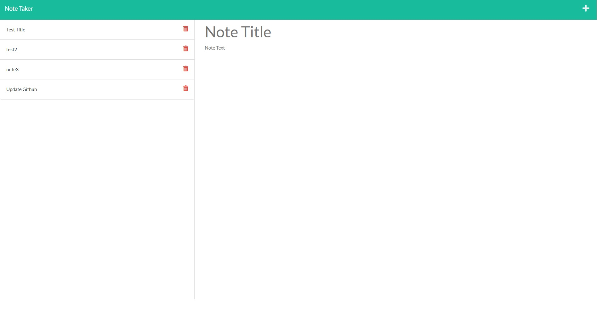

# Take a Note Leave a Note 

  # About
  This application allows you to take notes. Each note will have a title as well as a body. Use it to help you stay organized, plan ahead, and turn big tasks into smaller steps and help you stay productive. It is easy to use with a simple interface. 
  
  ## Table of Contents
  - [Intallation](#installation)
  - [Usage](#usage)
  - [Credit](#credit)
  - [License](#license)
  - [Questions](#test)

  # Installation
  Clone or download the repository. In the directory where the application is located, run npm i in your terminal to install the necessary node modules. When this is done, the app will be ready to run by typing node server into your terminal. You will receive a message telling you which port it is running on. Go to your browser and navigate to localhost:(your port number here). To view a live version of the app already running, visit the [live link.](https://floating-shore-06305.herokuapp.com/)

  # Usage
  Once the application is running, you will be taken to a title screen. Click the 'Get Started' button. There, you will find any notes previously recorded by the application. Click any of your notes on the left to view them in the main window. If you would like to add a new note, click the + sign on the top right of the window. Your main window will show "Note Title" and "Note Text." Click either of these areas to enter your own text. Once you are satisfied with the contents of your note, click the disk icon in the top right to save the note and add it to your list of notes. 

  

  # Future
  There is currently a delete icon next to the notes. As of now, the button does not function. This feature will be added in a later release. 

  # Credit
  Created by Austin Carter. 

  # License
  This project is covered under the gpl3.0 license. For more information, visit this [resource](https://choosealicense.com/licenses/) on project licenses.

  # Questions
  If you have any questions, you can find me on [github](https://github.com/auscarter17).
  

